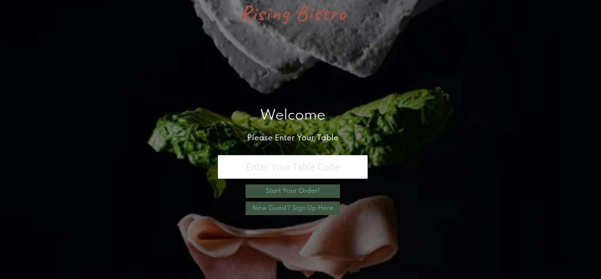

# `Checkout, Landing Page and Navigation Component`

## The checkout page that will be rendered when a guest completes their order

### `Landing Page`



### `Checkout Page`


### `Navigation Page`


```js
<section class="container">
                    <div class="columns is-multiline">
                        <div class="column is-8 is-offset-2 register">
                            <div class="columns">
                                <div class="column left">
                                    <h1 class="title is-1">Order Details</h1>
                                    <h2 class="subtitle colored is-4"></h2>
                                    <p id="menu-items">[Food Item]</p>
                                    <p id="menu-items">[Drink Item]</p>
                                    <p id="menu-items">[Desert Item]</p>
                                </div>
                                <div class="column right has-text-centered">
                                    <h1 class="title is-4">Ready to Pay?</h1>
                                    <form>
                                        <div><h1>Ready to Checkout?</h1></div>
                                        <button class="button is-block is-primary is-fullwidth is-medium">Pay Now</button>
                                    </form>
                                </div>
                            </div>
                        </div>
                        <div class="column is-8 is-offset-2">
                            <br />
                            <nav class="level">
                            </nav>
                        </div>
                    </div>
                </section>

```
